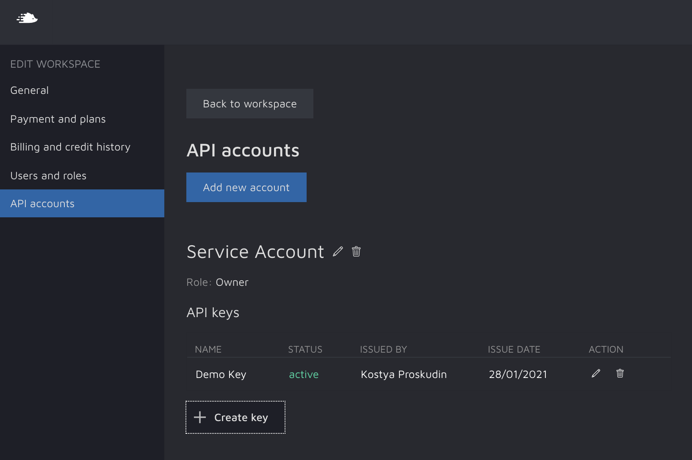

Quick Start
===========

Authentication
^^^^^^^^^^^^^^
In order to communicate with your Hasty server via the API, you must provide valid API Key. The Key can be generated on Edit Workspace page (Hasty -> Edit Workspace -> API Accounts)

You will need to create a service account, define it's role and finally generate API Key:

Create a Hasty API Client instance
^^^^^^^^^^^^^^^^^^^^^^^^^^^^^^^^^^

This example shows how to create establish your initial connection to Hasty:

::

    from hasty import Client

    API_KEY = "bNZ09SA2hFSZGHa6jfMK2Ywo7GoActTXNCvJR1wEkVDtKvl9EMTLRvknwmwUz7Hjl1jPwxYBkyGF8BcWV3y9rg"

    h = Client(api_key=API_KEY)

